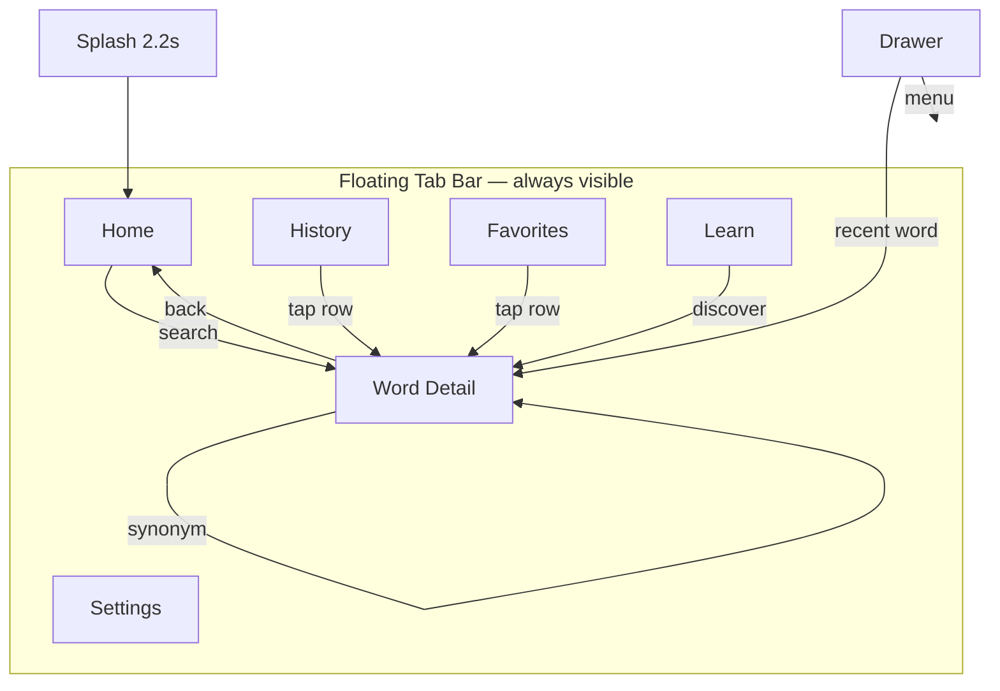

# Screen Flow Map



## Figma frame naming convention

```
01-Splash
02-Home-Default
02-Home-Suggestions
02-Home-Empty-Hint
03-WordDetail-Loading
03-WordDetail-Success
03-WordDetail-NotFound
03-WordDetail-NetworkError
04-History-List
04-History-Empty
05-Favorites-List
05-Favorites-Empty
06-Learn
07-Settings
08-Drawer-Open
09-Components-Library
10-Utilities-Toasts-Loaders
```

Use **Light** and **Dark** suffix variants: `02-Home-Default-Light`, `02-Home-Default-Dark`.
