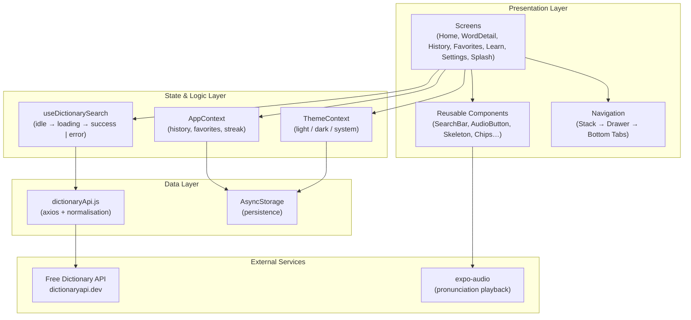
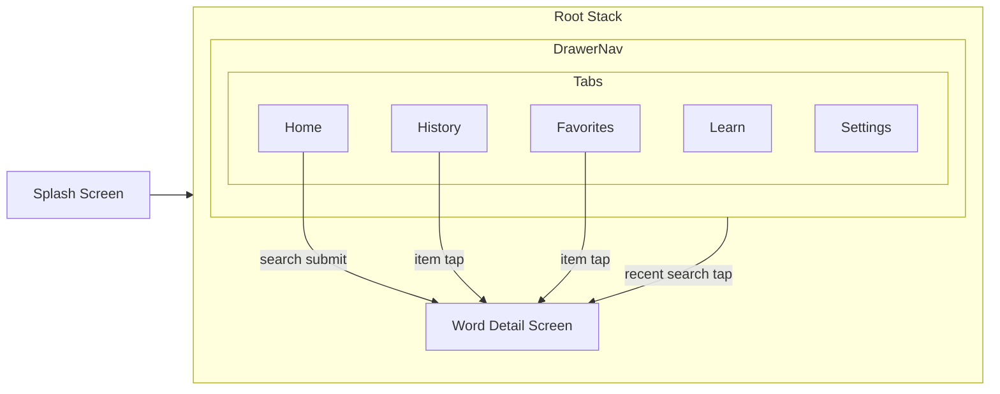

# LexiDict — Application Architecture

LexiDict is a cross-platform dictionary app built with **Expo SDK 56** and **React Native**, consuming the [Free Dictionary API](https://dictionaryapi.dev/).

## High-Level Architecture



## Layer Responsibilities

| Layer | Responsibility |
|-------|----------------|
| **Presentation** | UI rendering, animations (Reanimated), navigation, user input |
| **State & Logic** | Theme preference, search history, favorites, streak, search state machine |
| **Data** | HTTP requests via axios, JSON normalisation, local persistence |
| **External** | Remote dictionary API, native audio playback |

## Folder Structure

```
LexiTech/
├── App.js                    # Root providers + splash gate
├── assets/
│   ├── brand/                # Logo assets from design brief
│   └── design/               # PDF + reference screenshot
├── docs/                     # Architecture & flow documentation
└── src/
    ├── api/                  # Axios client + error taxonomy
    ├── components/           # Shared UI building blocks
    ├── context/              # Global app state
    ├── hooks/                # useDictionarySearch state machine
    ├── navigation/           # Stack, Drawer, Tabs
    ├── screens/              # Feature screens
    ├── theme/                # Design tokens + ThemeContext
    └── utils/                # Constants & helpers
```

## Navigation Architecture



## Key Design Decisions

1. **Single API source** — All word data comes from the Free Dictionary API; features like Word of the Day use a curated pool but still fetch real definitions on tap.
2. **Normalised view-model** — Raw API JSON is merged and cleaned in `dictionaryApi.js` so screens never parse malformed payloads.
3. **Typed errors** — `DictionaryError` with `ErrorKind` lets the UI show specific messages (404, network, validation) and retry actions.
4. **Token-based theming** — Light/dark palettes share one token object; switching mode updates every screen instantly.
5. **Drawer + Tabs** — Bottom tabs for primary navigation; drawer exposes search history (Activity 4 requirement).

## Technology Stack

| Technology | Purpose |
|------------|---------|
| Expo 56 | Cross-platform runtime & tooling |
| React Navigation 7 | Stack, Drawer, Tab navigation |
| axios | HTTP client for dictionary API |
| AsyncStorage | Persist history, favorites, theme, streak |
| react-native-reanimated | Splash, fade-in, skeleton shimmer, audio pulse |
| expo-audio | Pronunciation play/pause |
| expo-haptics | Tactile feedback on search & favorites |
