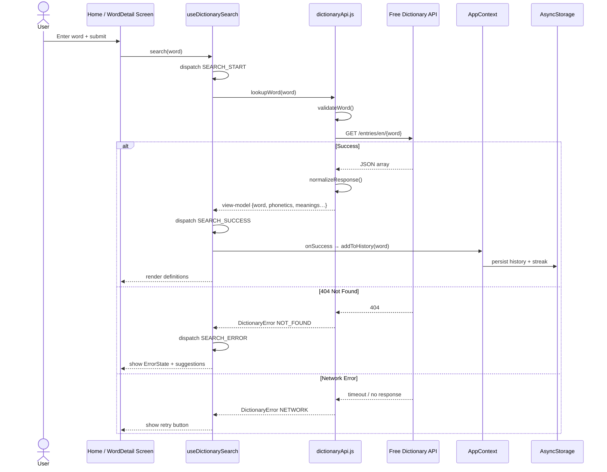
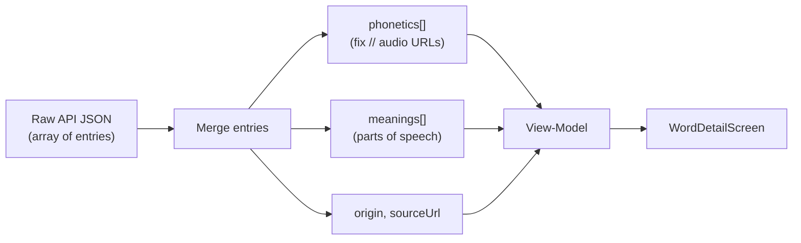
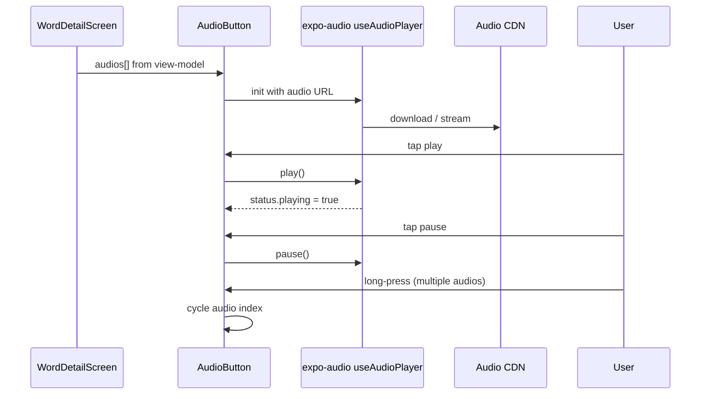
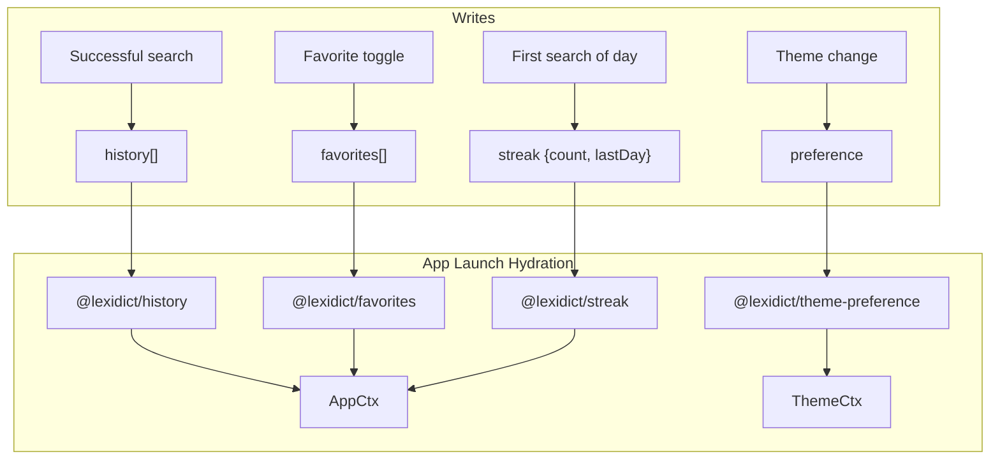
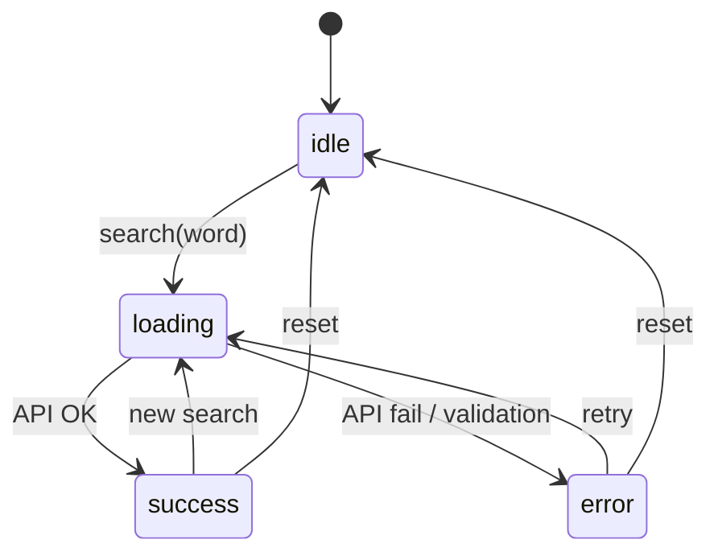

# LexiDict — Data Flow Diagram

This document describes how data moves through the application from user input to display and persistence.

## Word Search Data Flow



## API Response Normalisation



### Normalised View-Model Shape

```json
{
  "word": "hello",
  "phonetic": "həˈləʊ",
  "phonetics": [{ "text": "həˈləʊ", "audio": "https://…" }],
  "audios": [{ "text": "…", "audio": "https://…" }],
  "hasAudio": true,
  "meanings": [{
    "partOfSpeech": "noun",
    "definitions": [{
      "definition": "…",
      "example": "…",
      "synonyms": [],
      "antonyms": []
    }]
  }],
  "origin": "…",
  "synonyms": ["…"],
  "sourceUrl": "…",
  "fetchedAt": 1710000000000
}
```

## Audio Pronunciation Flow (Activity 3)



## Persistence Data Flow



## Search State Machine


