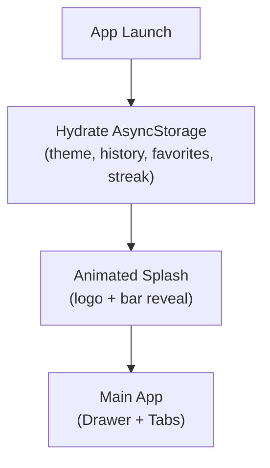
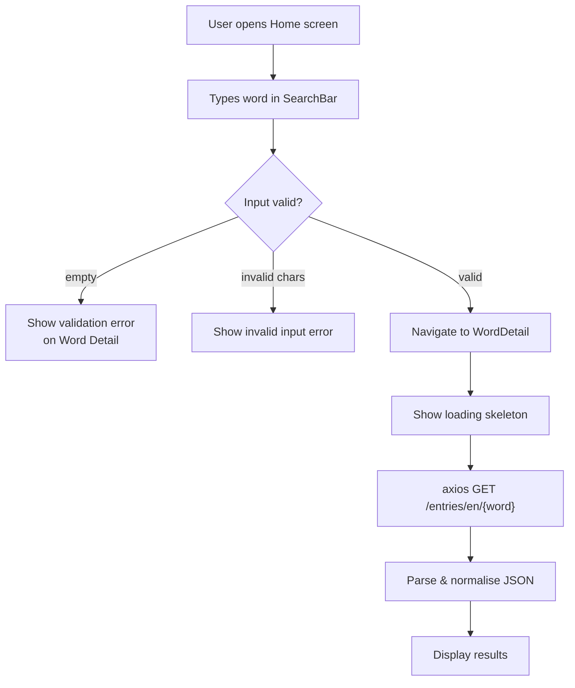
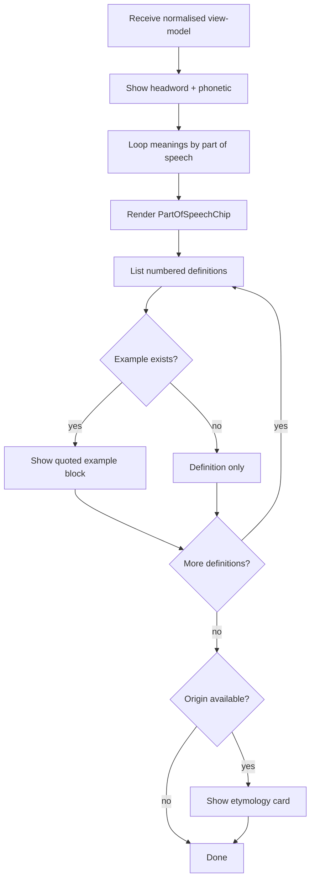
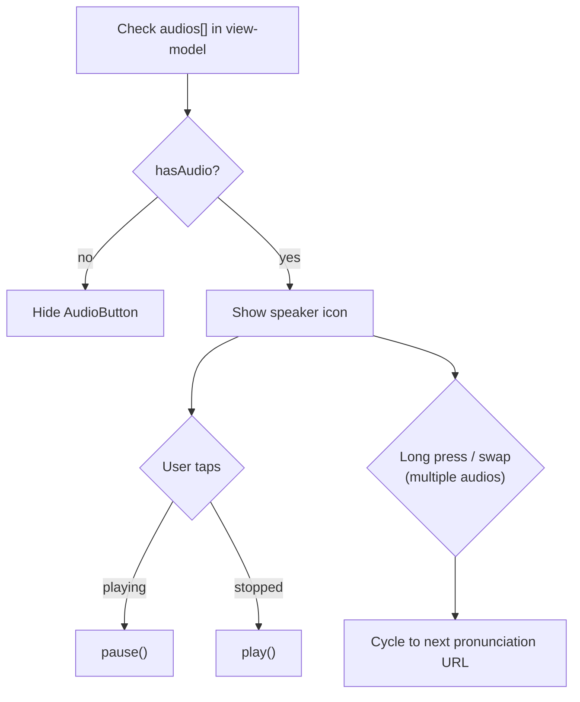
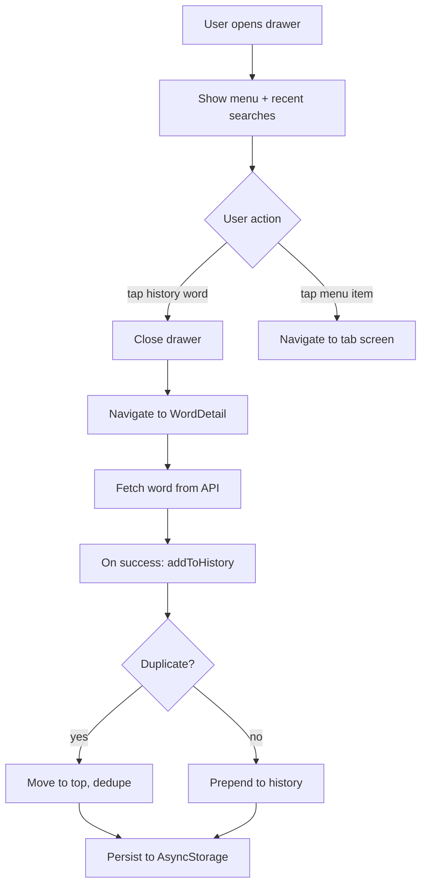
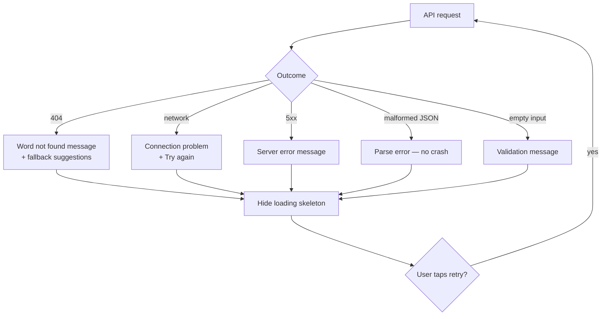
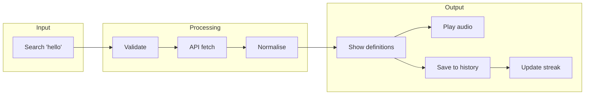

# LexiDict — System Flow Diagram

End-to-end user journeys and system behaviour for all five activities in the project brief.

## Application Lifecycle

## Activity 1 — Word Search & API Integration

## Activity 2 — Display Word Details

## Activity 3 — Audio Pronunciation

## Activity 4 — Drawer Navigation & Search History

## Activity 5 — Error Handling & User Feedback

## Complete User Journey (Happy Path)

## Screen Map

| Screen | Entry Points | Primary Actions |
|--------|-------------|-----------------|
| **Splash** | App launch | Auto-transition to main |
| **Home** | Tab, Drawer | Search, Word of the Day, suggestions |
| **Word Detail** | Search, History, Drawer, Favorites, Learn | View defs, audio, favorite |
| **History** | Tab, Drawer | Re-search, remove, clear all |
| **Favorites** | Tab, Drawer | Open saved words, unfavorite |
| **Learn** | Tab | Tips, discover random word |
| **Settings** | Tab | Theme: system / light / dark |
